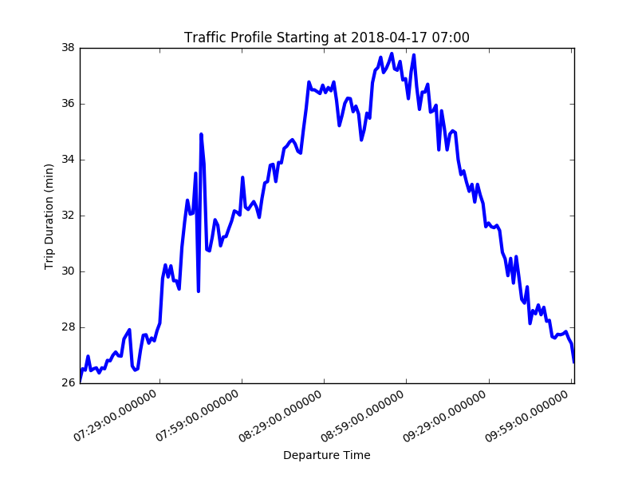

# traffic-profile
Designed for characterizing the traffic along some route over an extended period of time utilizing google maps.
### Usage

```shell
$ python traffic_profile_generator.py route_to_work.yaml --hours 4
```
The fist argument is a yaml file with origin and destination of the route. The optional second argument is the integer number of hours to record traffic data over: the default is 3 hours. Outputs are a plot of the traffic duration over the observation period and the same data logged to a CSV file.




### Setup

First you'll need a Google maps API key stored in a config file named config.py, an example of its contents are below.

```python
key = '********************************' # replace with your actual key

```

Then you'll need a route defined in a yaml file. The contents of the yaml file should look like the example below.

```yaml
origin: "1 World Way, Los Angeles, CA 90045"
destination: "3600 S Las Vegas Blvd, Las Vegas, NV 89109"
```

### A Note About Cron

I've found that a really useful way to run this is by setting up a crontab to execute the program on a regular basis.
When doing this, be careful to include the full path of both the python script and the yaml. An example of a crontab
that runs the script for a route *to* work from 7 AM to 10 AM on weekdays and a route *from* work from 4 PM to 8 PM on
weekdays.

```shell
trent@trent-X1C:~$ crontab -l
# Edit this file to introduce tasks to be run by cron.
# 
# Each task to run has to be defined through a single line
# indicating with different fields when the task will be run
# and what command to run for the task
# 
# To define the time you can provide concrete values for
# minute (m), hour (h), day of month (dom), month (mon),
# and day of week (dow) or use '*' in these fields (for 'any').# 
# Notice that tasks will be started based on the cron's system
# daemon's notion of time and timezones.
# 
# Output of the crontab jobs (including errors) is sent through
# email to the user the crontab file belongs to (unless redirected).
# 
# For example, you can run a backup of all your user accounts
# at 5 a.m every week with:
# 0 5 * * 1 tar -zcf /var/backups/home.tgz /home/
# 
# For more information see the manual pages of crontab(5) and cron(8)
# 
# m h  dom mon dow   command

0 7 * * 1-5 python /home/trent/documents/traffic-profile/traffic_profile_generator.py /home/trent/documents/traffic-profile/route_to_work.yaml
0 16 * * 1-5 python /home/trent/documents/traffic-profile/traffic_profile_generator.py /home/trent/documents/traffic-profile/route_from_work.yaml --hours 4
```
